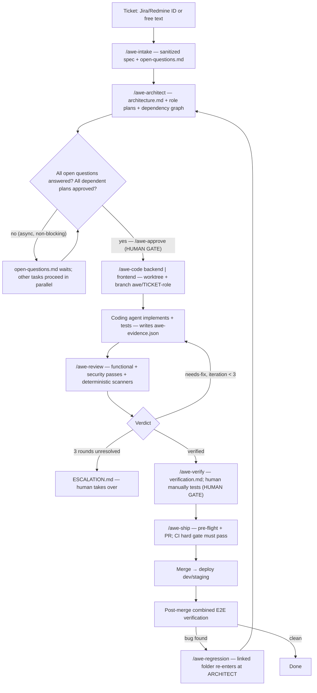
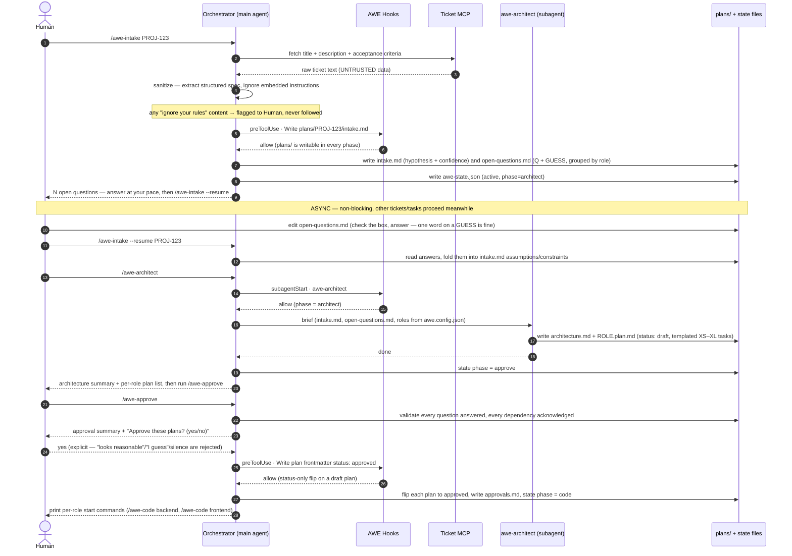
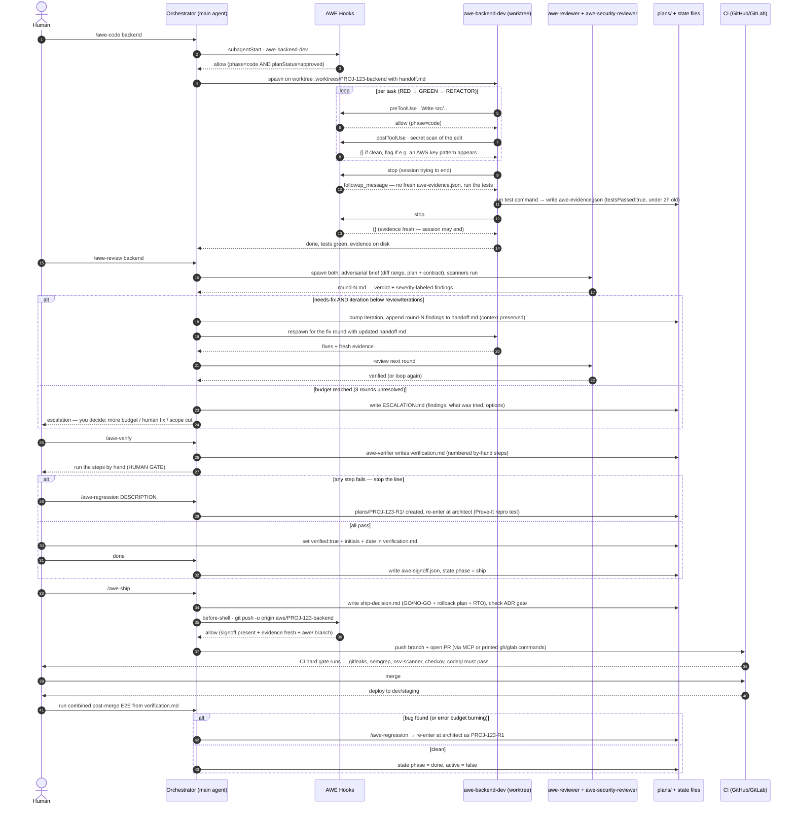

# AWE Flow — the pipeline, drawn

This page shows how a ticket moves through AWE: the phases, the human gates, and the
hooks that enforce them. It's the visual companion to the **Daily workflow** section of
the [README](../README.md) and to the `.cursor/rules/10-awe-phases.mdc` rule.

- **Skill** — a slash-command playbook you invoke (`/awe-intake`, `/awe-code`, …).
- **Hook** — a script Cursor runs around a tool call (write, shell, subagent spawn, stop) that can allow/deny it.
- **Subagent** — a fresh-context agent the orchestrator spawns (architect, dev, reviewer, verifier).
- **Worktree** — an isolated git working copy on its own branch, so roles code in parallel without colliding.

## The whole pipeline

## Phase walkthrough (what actually runs)

**1 — INTAKE** (`/awe-intake`). Pulls the ticket via the ticket MCP (or you paste text), treats it as **untrusted data**, and writes a sanitized `plans/<ticket>/intake.md` plus `open-questions.md` — each question carries a hypothesis, a confidence number, and a `GUESS:` so you answer with one word. Writes `awe-state.json` (`phase: architect`). *Hook involved:* `pre-tool-gate.mjs` allows writes only under `plans/` and `.cursor/state/` while in a planning phase.

**2 — ARCHITECT** (`/awe-architect`). The `awe-architect` subagent (gated by `subagent-gate.mjs`) turns the spec into `architecture.md` (dependency graph + cross-role contract) and one `<role>.plan.md` per role, each task templated (acceptance criteria, verify command, files, XS–XL size). Plans land as `status: draft`.

**3 — APPROVE** (`/awe-approve`) ▣ **human gate**. Validates every open question is answered and every dependency acknowledged, rejects hedged approvals ("looks reasonable" ≠ yes), then flips each plan to `status: approved`. *Hooks involved:* `pre-tool-gate.mjs` blocks all code writes until this flips `phase: code`; the plan-clobber guard makes approved plans append-only.

**4 — CODE** (`/awe-code <role>`). Creates a worktree + branch `awe/<ticket>-<role>`, writes `handoff.md`, spawns the role dev subagent (gated by `subagent-gate.mjs` — needs `phase: code` + approved plan). The coder works test-first (RED→GREEN→REFACTOR) using the repo's own commands. *Hooks involved:* `pre-tool-gate.mjs` allows code writes; `post-tool-scan.mjs` secret-scans every edit; `before-shell.mjs` blocks dangerous commands; `stop-evidence.mjs` refuses to end the session without a fresh `awe-evidence.json` (`testsPassed:true`, < 2 h old).

**5 — REVIEW** (`/awe-review <role>`). Runs scanners, then spawns `awe-reviewer` + `awe-security-reviewer` in parallel — a fresh-context **adversarial** pass over the diff against the plan and acceptance criteria. Findings are severity-labeled (Critical ⇒ the iteration fails). *needs-fix* respawns the coder with `handoff.md` updated (context preserved); *verified* moves on; three unresolved rounds write `ESCALATION.md` and hand it to you.

**6 — VERIFY** (`/awe-verify`) ▣ **human gate**. The `awe-verifier` subagent writes `verification.md`: numbered, by-hand test steps. You run them; a failure is stop-the-line → `/awe-regression`. On pass you set `verified: true` + initials + date, and the skill writes `awe-signoff.json`.

**7 — SHIP** (`/awe-ship`). Pre-flight checks signoff + fresh evidence + clean scanners, writes the **Ship Decision** artifact (`ship-decision.md`: GO/NO-GO + rollback plan + RTO) and checks the **ADR docs gate**. Then commits, pushes `awe/<ticket>-*` (allowed by `before-shell.mjs` only now), and opens the PR via MCP or printed `gh`/`glab` commands.

**8 — POST-MERGE E2E.** After you merge and CI's hard gate passes, run the combined end-to-end steps from `verification.md` against the merged result, watching the rollout thresholds and error-budget gate. A regression re-enters at ARCHITECT via `/awe-regression` as `plans/<ticket>-R<N>/`; clean means done.

---

## Sequence: Intake → Architect → Approve (async Q&A)

The first half of the pipeline. Note the untrusted-ticket sanitization, the hook allow/deny
on writes, the subagentStart gating, and that open questions are **async and non-blocking** —
the human answers at their own pace while other work proceeds.

---

## Sequence: Code → Review loop → Verify → Ship → Post-merge

The second half. Note the secret scan on every edit, the stop-hook evidence loop, the
needs-fix respawn with `handoff.md` carrying context forward, the escalation path, the human
signoff, the ship pre-flight, the CI hard gate, and the regression re-entry.

---

*Enforcement detail: every allow/deny above comes from a real hook in `.cursor/hooks/`
(`pre-tool-gate`, `before-shell`, `before-read`, `post-tool-scan`, `subagent-gate`,
`stop-evidence`, `constraints-guard`). When AWE is inactive — no `awe-state.json`, or
`AWE_DISABLED=1` — every hook exits immediately and interferes with nothing.*
