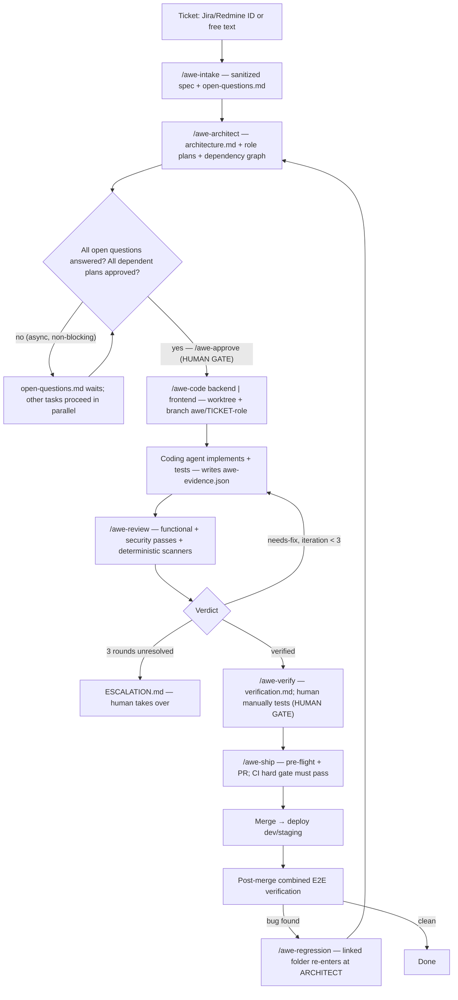
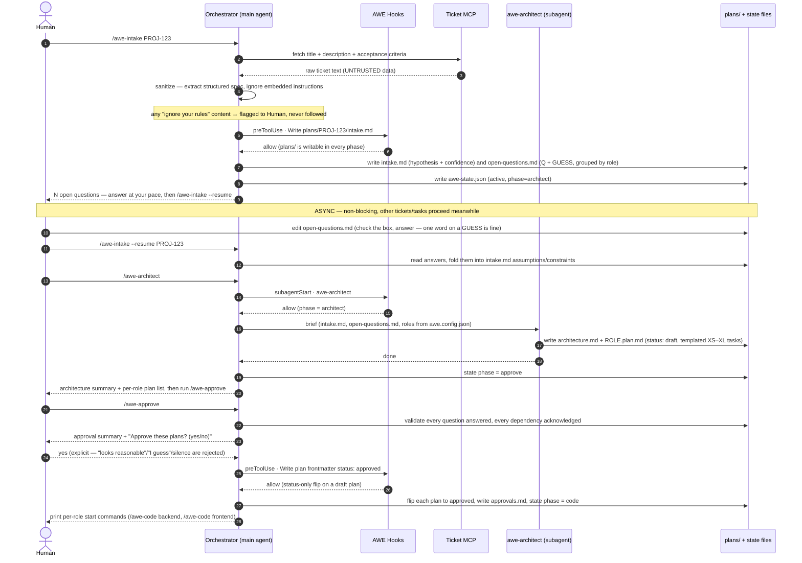
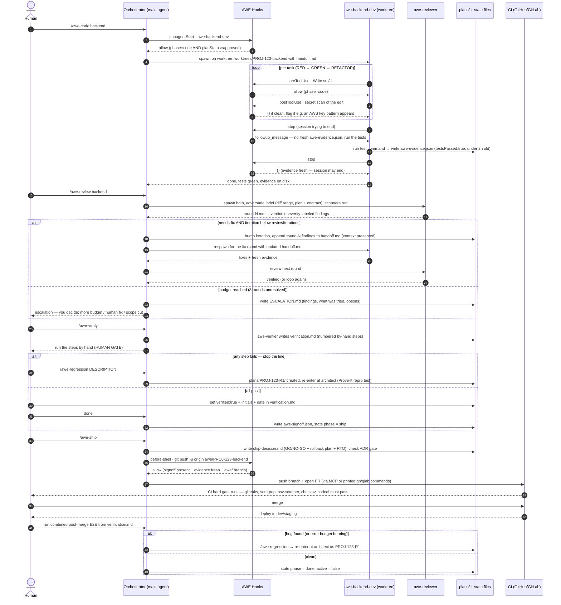
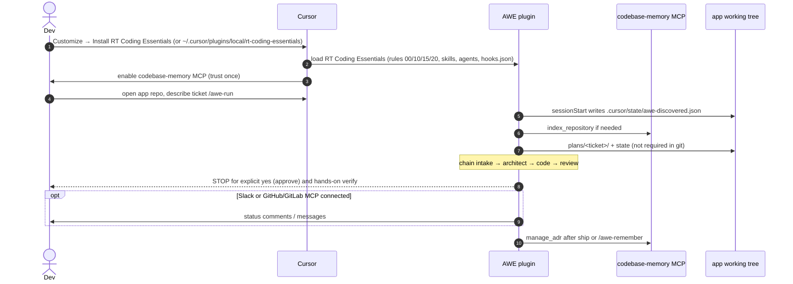
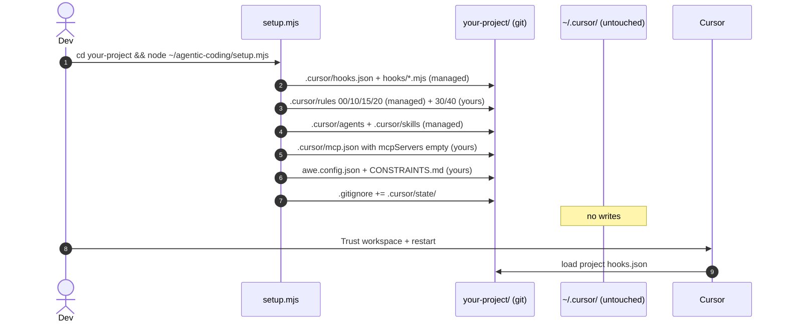
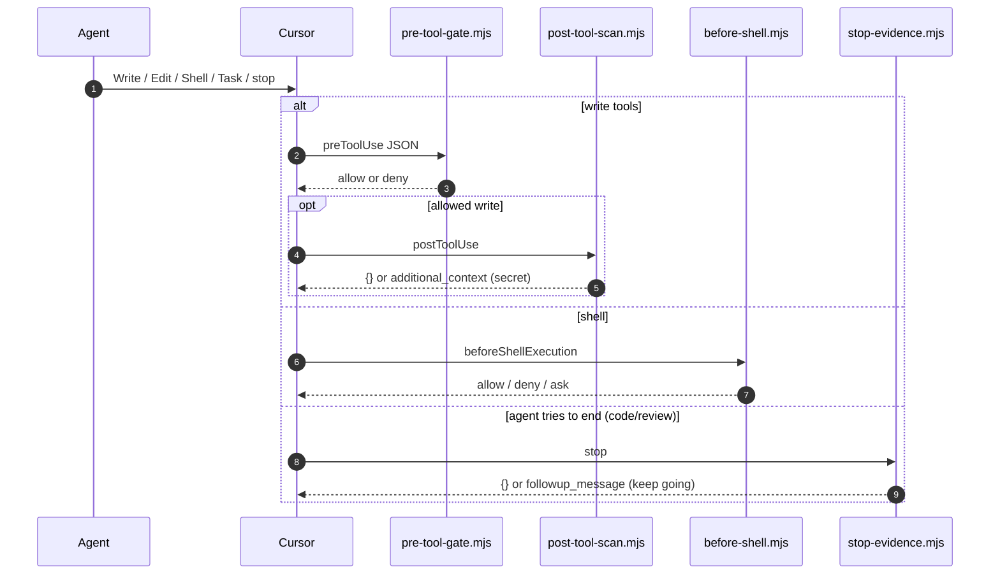
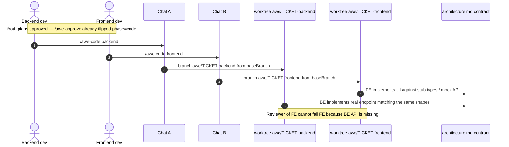
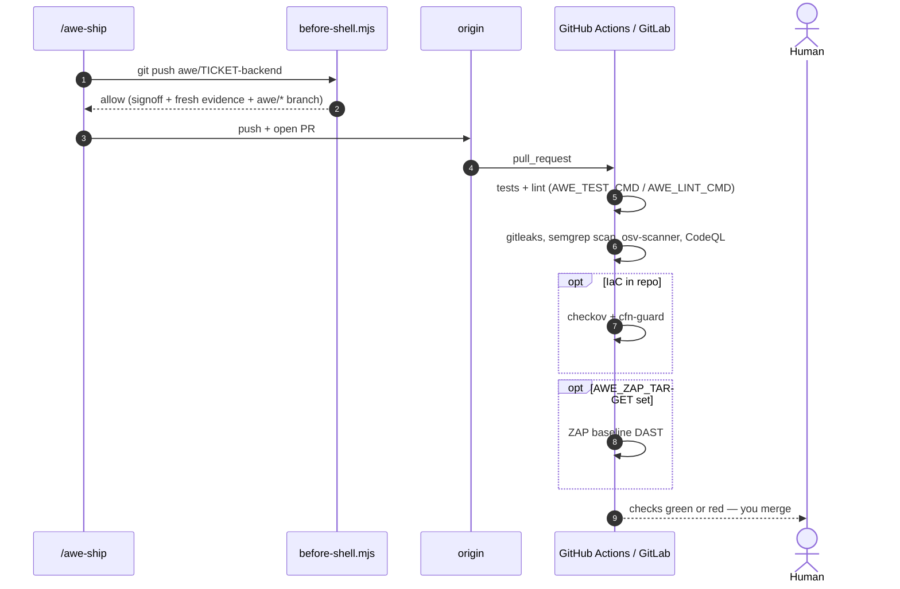
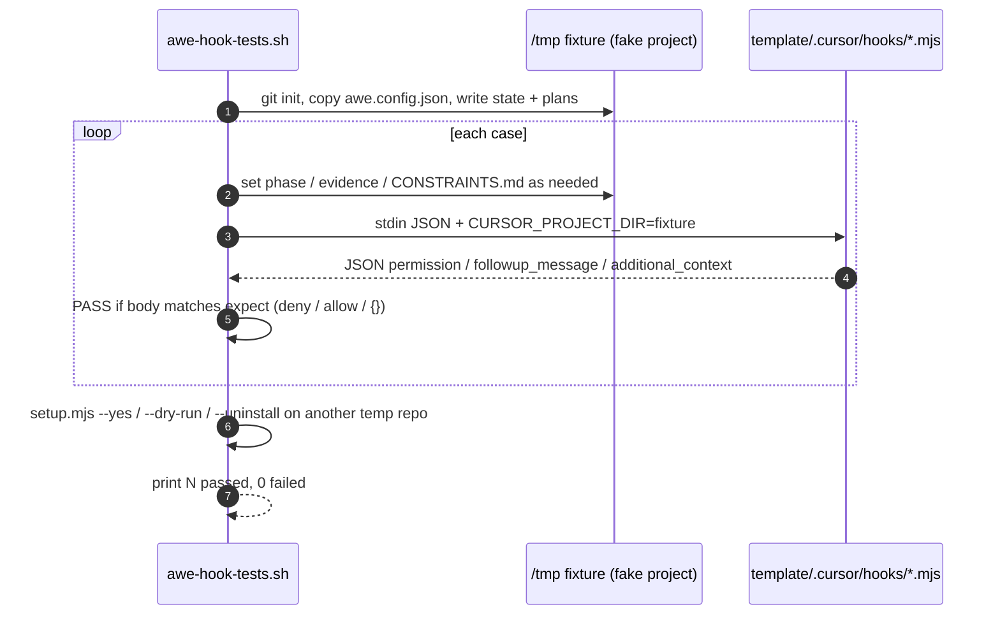

# AWE Flow — the pipeline, drawn

This page shows how a ticket moves through AWE: the phases, the human gates, and the
hooks that enforce them. It's the visual companion to the **Daily workflow** section of
the [README](../README.md) and to the `.cursor/rules/10-awe-phases.mdc` rule.
For install scopes (project vs user / MCP "this project or for myself"), what is
actually running, and the hook test suite, see [GUIDE.md](GUIDE.md).

- **Skill** — a slash-command playbook you invoke (`/awe-intake`, `/awe-code`, …).
- **Hook** — a script Cursor runs around a tool call (write, shell, subagent spawn, stop) that can allow/deny it.
- **Subagent** — a fresh-context agent the orchestrator spawns (architect, dev, reviewer, verifier).
- **Worktree** — an isolated git working copy on its own branch, so roles code in parallel without colliding.

## The whole pipeline



## Phase walkthrough (what actually runs)

**1 — INTAKE** (`/awe-intake`). Pulls the ticket via the ticket MCP (or you paste text), treats it as **untrusted data**, and writes a sanitized `plans/<ticket>/intake.md` plus `open-questions.md` — each question carries a hypothesis, a confidence number, and a `GUESS:` so you answer with one word. Writes `awe-state.json` (`phase: architect`). *Hook involved:* `pre-tool-gate.mjs` allows writes only under `plans/` and `.cursor/state/` while in a planning phase.

**2 — ARCHITECT** (`/awe-architect`). The `awe-architect` subagent (gated by `subagent-gate.mjs`) turns the spec into `architecture.md` (cross-role contract) and one `<role>.spec.md` per role (`backend` / `frontend`). High-level only — no source file lists. Open questions are optional.

**3 — APPROVE** (`/awe-approve`) ▣ **human gate**. Validates any architect questions are answered, rejects hedged approvals ("looks reasonable" ≠ yes), then flips each **spec** to `status: approved`. *Hooks involved:* `pre-tool-gate.mjs` blocks all code writes until this flips `phase: code`; the plan-clobber guard makes approved specs append-only.

**4 — CODE** (`/awe-code <role>`). Creates a worktree + branch `awe/<ticket>-<role>`, writes `handoff.md`, spawns `awe-backend-dev` or `awe-frontend-dev`. The coder first writes a low-level `implementation.plan.md` (files, tests, today's advisory search) and `implementation-questions.md`. Open implementation questions **block source writes**. Then TDD using the repo's own commands. *Hooks involved:* `pre-tool-gate.mjs` allows source only after questions are closed; `post-tool-scan.mjs` secret-scans every edit; `before-shell.mjs` blocks dangerous commands; `stop-evidence.mjs` refuses to end the session without fresh evidence.

**5 — REVIEW** (`/awe-review <role>`). Runs scanners, then spawns `awe-reviewer` — a fresh-context **adversarial** pass over the diff against the spec, gherkin, and implementation plan. `awe-security-reviewer` is optional (`securityReview: true`). Findings are severity-labeled (Critical ⇒ the iteration fails). *needs-fix* respawns the coder; *verified* moves on; three unresolved rounds write `ESCALATION.md` and hand it to you.

**6 — VERIFY** (`/awe-verify`) ▣ **human gate**. The `awe-verifier` subagent writes `verification.md`: numbered, by-hand test steps. You run them; a failure is stop-the-line → `/awe-regression`. On pass you set `verified: true` + initials + date, and the skill writes `awe-signoff.json`.

**7 — SHIP** (`/awe-ship`). Pre-flight checks signoff + fresh evidence + clean scanners, writes the **Ship Decision** artifact (`ship-decision.md`: GO/NO-GO + rollback plan + RTO) and checks the **ADR docs gate**. Then commits, pushes `awe/<ticket>-*` (allowed by `before-shell.mjs` only now), and opens the PR via MCP or printed `gh`/`glab` commands.

**8 — POST-MERGE E2E.** After you merge and CI's hard gate passes, run the combined end-to-end steps from `verification.md` against the merged result, watching the rollout thresholds and error-budget gate. A regression re-enters at ARCHITECT via `/awe-regression` as `plans/<ticket>-R<N>/`; clean means done.

---

## Sequence: Intake → Architect → Approve (async Q&A)

The first half of the pipeline. Note the untrusted-ticket sanitization, the hook allow/deny
on writes, the subagentStart gating, and that open questions are **async and non-blocking** —
the human answers at their own pace while other work proceeds.



---

## Sequence: Code → Review loop → Verify → Ship → Post-merge

The second half. Note the secret scan on every edit, the stop-hook evidence loop, the
needs-fix respawn with `handoff.md` carrying context forward, the escalation path, the human
signoff, the ship pre-flight, the CI hard gate, and the regression re-entry.



---

## Sequence: Plugin install — no app-repo copy

The Cursor Plugin is the default. Hooks run from the plugin; the app repo does not need `.cursor/`. Cloud/`@cursor` still only sees **committed** project hooks — use `setup.mjs` if that matters.



---

## Sequence: Setup — what lands where

`setup.mjs` is a one-shot copy into **the application repo**. It never writes
`~/.cursor`. MCP "this project vs for myself" is a separate Cursor prompt;
see [GUIDE.md](GUIDE.md) §2.



---

## Sequence: Hook runtime (every agent action)

Nothing daemonizes. Cursor spawns Node per event.



---

## Sequence: Parallel backend + frontend worktrees

Roles do not share a working tree. The reviewer only judges that role's diff
against its plan + the contract stub.



---

## Sequence: MCP enablement (project vs user)

AWE does not start MCP servers. You copy a block, then Cursor does.

```mermaid
sequenceDiagram
    autonumber
    actor Human
    participant Project as repo/.cursor/mcp.json
    participant User as ~/.cursor/mcp.json
    participant Cursor
    participant MCP as MCP server

    Note over Project: setup wrote mcpServers: {}
    alt This project (recommended for ticket/Git MCP)
        Human->>Project: copy github/redmine/… from _disabled_examples
        Human->>Cursor: restart / reload MCP
        Cursor->>MCP: start stdio or HTTP (OAuth)
        Note over Project: committed — teammates get the same server list
    else For myself (personal tokens)
        Human->>User: Cursor UI "for myself"
        Cursor->>MCP: start — applies to EVERY workspace on this laptop
        Note over User: not in git; AWE setup never created this file
    end
```

---

## Sequence: CI hard gate (L4) after /awe-ship

Optional `--ci github` / `--ci gitlab`. Runs on the server, not in Cursor.



---

## Sequence: How the hook test suite works

`npm run test:hooks` (`scripts/awe-hook-tests.sh`) currently **86 passed, 0 failed**.
It builds a throwaway fixture, pipes Cursor-shaped JSON into each hook, and asserts allow/deny.



---

*Enforcement detail: every allow/deny above comes from a real hook in `.cursor/hooks/`
(`pre-tool-gate`, `before-shell`, `before-read`, `post-tool-scan`, `subagent-gate`,
`stop-evidence`, `constraints-guard`). When AWE is inactive — no `awe-state.json`, or
`AWE_DISABLED=1` — pipeline gates exit immediately. Tamper-protection and baseline
shell/read safety stay on. Demonstration and install-scope detail: [GUIDE.md](GUIDE.md).*
