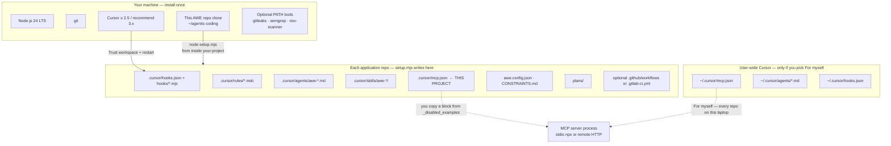
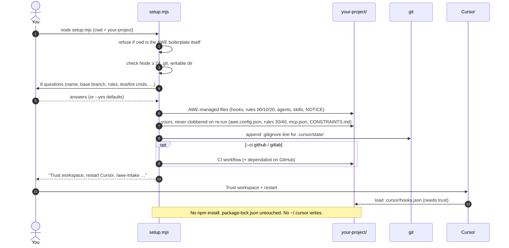
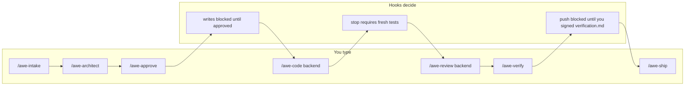
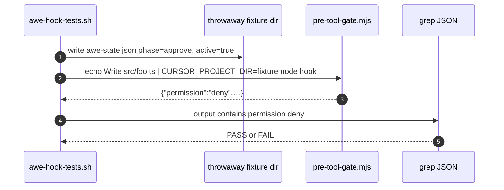

# AWE Demonstration Guide

How AWE installs, where files land, what is actually running, how a ticket
moves through the pipeline, and how we proved the gates work.

Companion pages:

- [README](../README.md) — install, daily commands, config
- [FLOW.md](FLOW.md) — pipeline flowchart + phase sequence diagrams

---

## 1. The one-sentence answer

**AWE is a Cursor Plugin first.** Install it from Customize (or a team marketplace). Skills, agents, rules 00/10/15/20, hooks, and the codebase-memory MCP come with it. Nothing is required in the application git repo. Optional `setup.mjs` still copies a project-local `.cursor/` when you want committed hooks (cloud agents) or a generated `awe.config.json`.

There is **no AWE daemon**. After install, the only thing "running" is Cursor:
every agent write, shell command, file read, subagent spawn, and session stop
spawns a short-lived Node hook that allow/deny's and exits.

---

## 2. Four install scopes (this is the MCP question)

Cursor's MCP UI asks **"this project" vs "for myself."** AWE uses the same
split. Mixing them up is the most common demo confusion.



| Scope | Path | Who sees it | AWE setup writes it? |
|---|---|---|---|
| **This project** | `<repo>/.cursor/mcp.json`, `.cursor/hooks.json`, `.cursor/rules/`, `.cursor/agents/`, `.cursor/skills/` | Everyone who clones the repo | **Yes** — this is the whole point |
| **For myself** | `~/.cursor/mcp.json`, `~/.cursor/hooks.json`, `~/.cursor/agents/` | Only your laptop, every workspace | **No.** AWE never touches your home directory |
| **This machine** | Node, git, Cursor, optional scanner binaries | You | You install these yourself (prereqs) |
| **CI** | `.github/workflows/awe-gates.yml` or `.gitlab-ci.yml` | The team's PRs | Only if you pass `--ci github` / `--ci gitlab` |

### When Cursor asks "this project or for myself?"

That prompt is **only for MCP servers** (and similar Cursor extras). It is not
how AWE itself is installed.

| Choice | File Cursor writes | Use it when |
|---|---|---|
| **This project** | `<repo>/.cursor/mcp.json` | The team should share the same ticket/Git MCP. Matches AWE: setup already created this file (empty `mcpServers`, examples in `_disabled_examples`). Copy a block in, commit, teammates enable it. |
| **For myself** | `~/.cursor/mcp.json` | A personal token you must not commit (Slack, Gmail, a PAT you don't want in git). It applies to **every** Cursor workspace on your machine, including repos that never ran AWE. |

**Recommended:** keep AWE MCPs in the **project** file. Leave `mcpServers: {}`
until you need one. Copy from `_disabled_examples`. Tokens go in env vars /
OAuth, not in git. Use **for myself** only for a personal notification MCP you
do not want in the repo.

AWE's project `mcp.json` ships with **every server disabled**. Enabling one is
a human edit. Cloud agents do not run MCP hooks; AWE's hard gates are command
hooks in the repo and still run in the cloud.

---

## 3. What `setup.mjs` puts on disk (and what it never does)

Run from **your application**, not from this boilerplate:

```bash
cd ~/your-project
node ~/agentic-coding/setup.mjs          # 8 prompts, Enter = default
# or
node ~/agentic-coding/setup.mjs --yes --ci github
```



**Managed (AWE-owned, refreshed on re-run):** hooks, constitution/phase/security
rules, agents, skills, `plans/README.md`, `NOTICE`, optional CI.

**Yours (written once, never overwritten):** `awe.config.json`,
`.cursor/rules/30-awe-project-profile.mdc`, `40-awe-project-custom.mdc`,
`.cursor/mcp.json`, `CONSTRAINTS.md`. If the template later changes, you get a
`*.new` sibling to merge by hand.

**Never installed:** npm packages into your app, global Cursor hooks, MCP
servers as running processes, scanner binaries (those are optional PATH tools).

**Runtime (gitignored, local only):** `.cursor/state/` — `awe-state.json`,
`awe-evidence.json`, `awe-signoff.json`, `audit.log`, `awe-manifest.json`.

Uninstall:

```bash
node ~/agentic-coding/setup.mjs --uninstall
```

Removes managed files only. Keeps your config, custom rules, mcp.json,
CONSTRAINTS.md, and `plans/**` history.

---

## 4. What is "running" after setup

| Thing | When it runs | Process model |
|---|---|---|
| Cursor agent | When you chat | Cursor's own harness |
| AWE hooks | On each matching event | `node .cursor/hooks/*.mjs` — JSON in, JSON out, exit |
| `/awe-*` skills | When you type the slash command | Prompt playbook; no extra process |
| Subagents | When a skill spawns them | Fresh Cursor agent context |
| MCP servers | Only if you enabled them | stdio (`npx …`) or remote HTTP |
| Optional scanners | When a hook/review/CI calls them | CLI if on PATH; else built-in regex / skip |
| CI gates | On PR | GitHub Actions / GitLab job — not on your laptop |

```mermaid
sequenceDiagram
    autonumber
    actor You
    participant Agent as Cursor agent
    participant Cursor as Cursor hook runner
    participant Hook as node .cursor/hooks/….mjs
    participant State as .cursor/state/
    participant Audit as audit.log

    You->>Agent: "just start coding" (phase still approve)
    Agent->>Cursor: preToolUse Write src/app.ts
    Cursor->>Hook: stdin JSON { tool_input: { file_path, content } }
    Hook->>State: read awe-state.json (phase=approve, active=true)
    Hook->>Audit: append deny line
    Hook-->>Cursor: {"permission":"deny","agent_message":"Phase is approve — code emission is blocked…"}
    Cursor-->>Agent: write rejected
    Agent-->>You: explains the gate; tells you to run /awe-approve
```

When **no ticket is active** (`awe-state.json` missing or `active: false`),
pipeline hooks return `{}` immediately. Two **always-on seatbelts** still fire:
tamper-protection (cannot edit hooks / `awe.config.json`) and baseline shell/
read safety (force-push, `curl|sh`, `.env` / `~/.aws` / `~/.ssh`). Kill switch:
`AWE_DISABLED=1` then restart Cursor — every hook short-circuits to allow.

---

## 5. Complete ticket flow (what to show in a demo)

Eight phases, two human keys. Full mermaid for intake→approve and
code→ship is in [FLOW.md](FLOW.md). This is the talk track.



**Parallel roles:** `/awe-code backend` and `/awe-code frontend` in two chats.
Each gets its own git worktree and branch `awe/<ticket>-<role>`. Frontend
codes against the **contract stub** in `architecture.md` so a missing API
does not fail frontend review.

**Async questions:** intake writes `plans/<ticket>/open-questions.md`. You
check boxes whenever you want. Other tickets continue. No blocking quiz.

**MCP in the flow:** if a ticket MCP is enabled in **project** `mcp.json`,
intake fetches the ticket. If not, you paste text. Ship opens a PR via MCP
or prints `gh pr create`. Same pipeline either way.

---

## 6. How we tested it (and how you re-run)

On 2026-09-08 the finishing pass piped JSON into every hook and ran
`setup.mjs` in a throwaway git repo: **73 passed, 0 failed**. That `/tmp`
script is gone; the same cases (plus extra ship/subagent assertions) now
live in-repo and currently report **86 passed, 0 failed**:

```bash
# from this boilerplate
npm run test:hooks
# or
bash scripts/awe-hook-tests.sh
```

How a single assertion works (this is what "the tests" were):



| Group | What was proven | Typical result |
|---|---|---|
| Syntax | `node --check` on setup + every hook | all OK on Node 24 |
| Setup smoke | `--yes` into a fresh git repo | writes managed + user files, gitignores `.cursor/state/` |
| Inactive | no state file → every pipeline hook `{}` | AWE does not interfere |
| Phase write-gate | approve + Write `src/` → **deny**; Write `plans/` → **allow** | OpenCode-style plan mode |
| Tamper | Write `hooks.json` / `awe.config.json` even while inactive → **deny** | agents cannot unplug the gate |
| Shell baseline | `git push --force`, `curl\|bash`, `npm publish`, `rm -rf /`, metadata IP, `cat ~/.aws` → **deny** | seatbelt always on |
| Ship push | `git push` in `code` → deny; in `ship` without signoff → ask; with signoff + fresh evidence + `awe/*` branch → allow | human VERIFY is load-bearing |
| Read gate | `.env`, `~/.ssh/id_rsa` → deny; `src/ok.ts` → `{}` | secrets stay out of context |
| Stop evidence | no/stale `awe-evidence.json` → `followup_message`; fresh green → `{}` | cannot declare victory |
| Secret scan | `AKIA…` / `BEGIN RSA PRIVATE KEY` → `additional_context`; clean file → `{}` | in-loop signal |
| Subagent gate | backend-dev denied in approve; allowed in code with approved plan; architect denied in code | role × phase |
| Plan-clobber | overwrite approved plan → deny; append / status flip / draft rewrite → allow | async worktrees |
| Constraints | remove `≥ 80%` coverage line → deny; pure addition → `{}`; delete file → deny | quality bar is human-owned |
| Kill switch | `AWE_DISABLED=1` → `{}` even for tamper/force-push | human override |
| Idempotency | second `--yes` → 0 written; `--dry-run` writes nothing; user drift → `*.new`; `--uninstall` keeps your files | safe re-run |

CI templates (`--ci both`) are YAML-checked separately; `npm run check`
syntax-checks setup + hooks.

---

## 7. Live 10-minute demo script (no MCP required)

1. **Show install scope.** Open this GUIDE's diagram. Say: "project `.cursor/`, not `~/.cursor`."
2. **Install into a throwaway repo** (or a real one):

   ```bash
   mkdir /tmp/awe-demo && cd /tmp/awe-demo && git init
   node /path/to/agentic-coding/setup.mjs --yes
   ```

3. Open that folder in Cursor → **Trust workspace** → restart.
4. `/awe-intake DEMO-1` — paste: `Add GET /health returning { ok: true }`.
5. **Show the block:** in the same chat, "just implement it in src now." The
   write-gate denies. Point at `.cursor/state/audit.log`.
6. Answer `open-questions.md` if any → `/awe-architect` → `/awe-approve` → **yes**.
7. `/awe-code backend` — worktree + tests + evidence file.
8. `/awe-review backend` → `/awe-verify` — you run `verification.md`, set
   `verified: true` + initials.
9. `/awe-ship` — or stop before push if this is a throwaway.

Optional: enable GitHub MCP in **this project's** `.cursor/mcp.json` (copy the
`github` block, OAuth), restart, then `/awe-intake` with a real issue number.

---

## 8. Team / cloud notes for demos

- **Each developer** clones AWE once, runs `setup.mjs` once per app repo (or
  your org checks the generated `.cursor/` into the app so they skip setup).
- **Cloud agents** honor **repo-committed** `.cursor/hooks.json`. They do **not**
  load `~/.cursor` hooks or `sessionStart` / MCP hooks. That is why AWE puts
  enforcement in project command hooks.
- **Auto trigger** (plan file lands → coding agent wakes) is optional Cursor
  Automations. Default is you type `/awe-code`. Keep APPROVE and VERIFY human.

---

*AWE v0.1.0 · project-scoped · zero runtime npm dependencies · Node 24 LTS*
